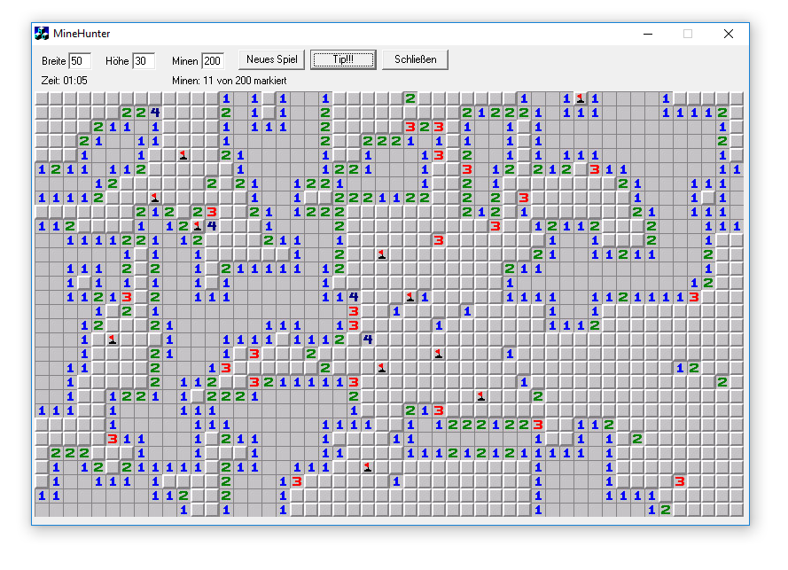

# MineHunter

> A MineSweeper clone for Windows I wrote in 2002 over the course of only a couple of hours

The killer feature of this app: You can create a gigantic grid, like 50x50 fields, plus you can specify the number of mines you want to have planted.

The app still runs under Windows 10!

To build it you would need Visual C++ 6.0.